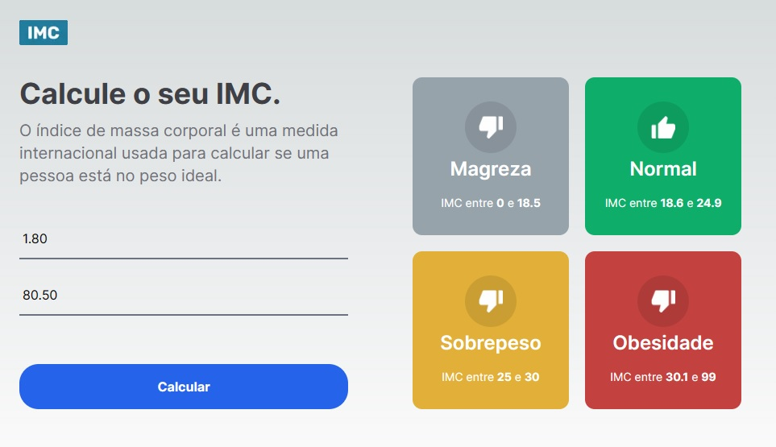
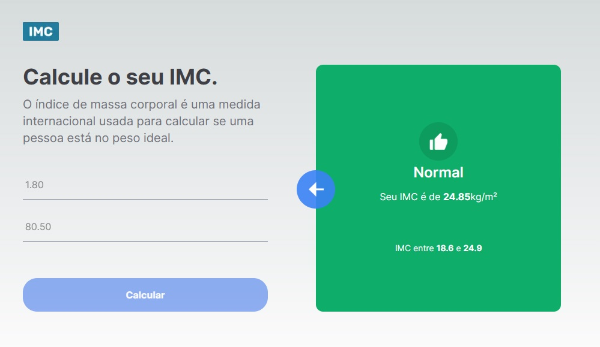

# Calculadora de IMC

Projeto "Calculadora de IMC" feito em React/NextJs (com Typescript + Tailwind CSS).

### Instalação
- `npm install`

### Para ligar o servidor
- `npm run start`

Com o servidor ligado clique em  [http://localhost:3000](http://localhost:3000) para acessar a tabela.

